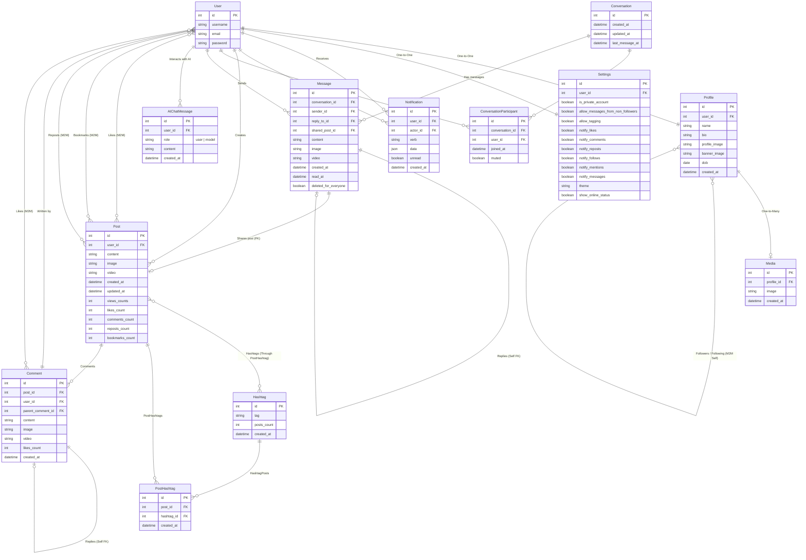

# ThoughtFlow Database Model Architecture

This document provides a visualization of the backend data structures and their relationships in the **ThoughtFlow** project, including the accounts, posts, user-to-user chat modules, and the proposed AI Assistant integration.

---

## 1. Entity Relationship (ER) Diagram

The diagram below shows how the different Django models are connected. The **solid arrows** indicate foreign keys (One-to-Many or One-to-One), and the **dashed arrows** indicate Many-to-Many connections or self-referential relations.

---

## 2. Core Model Schemas

### Accounts App
1. **Profile**: Linked directly to a single `User`. Contains user metadata (bio, avatars) and self-referential many-to-many fields for follows.
2. **Settings**: Configures account privacy, interface preferences (theme), and granular email/push notifications.
3. **Notification**: Dispatched to users when other actors perform social actions on their content.

### Posts App
1. **Post**: Holds user posts. Tracks counters (`likes_count`, `views_counts`, etc.) directly on the database row to prevent heavy aggregates.
2. **Comment**: Allows hierarchical threading of discussions on a post via the `parent_comment` recursive foreign key.
3. **Hashtag**: Tracks popular terms, enabling rapid retrieval of posts via a junction table `PostHashtag`.

### Chat App
1. **Conversation**: A container group for messages between users.
2. **ConversationParticipant**: The intermediate table tracking user membership, unread statuses, and mute state.
3. **Message**: Individual message payloads. Supports text, image, video attachments, as well as replies and post shares.

---

## 3. Proposed AI Chat Integration
The `AIChatMessage` model will:
* Point back to the authenticated `User` using a Foreign Key.
* Use a `role` field (`'user'` or `'model'`) to format message streams.
* Store text output (`content`) and a timestamp (`created_at`).
* **Why this works**: By storing each prompt and completion as distinct rows, we can easily feed the preceding context window (e.g. the last 10 messages) to LLM APIs like Gemini, enabling full, stateful conversations.
