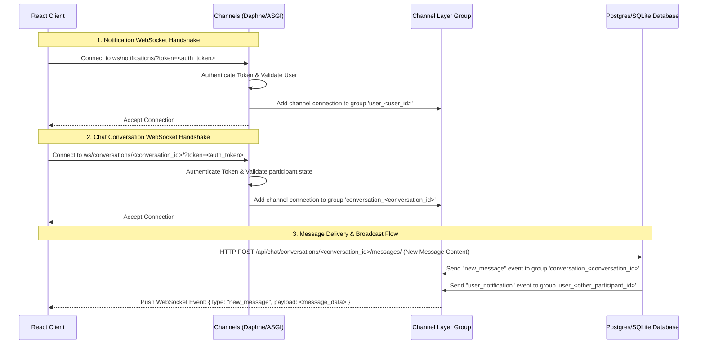

# ThoughtFlow WebSocket Flow & Chat API Documentation

This document describes the networking architecture of ThoughtFlow's real-time messaging engine, specifying all WebSocket connection states, message channels, and REST HTTP API endpoints.

---

## 1. Real-Time WebSocket Flows

ThoughtFlow utilizes Django Channels and WebSockets to deliver instantaneous updates. Clients connect using their authentication token passed via the URL query parameters.

### Connection Architecture


---

## 2. WebSocket Channels & Protocols

### A. Notifications Channel
* **Path**: `ws/notifications/`
* **Purpose**: General, app-wide real-time signals, including notification count badges and incoming chat alerts.
* **Backend Group**: `user_<user_id>`
* **Server-to-Client Messages**:
  * **Event Notification**: Sent when the user receives any notification (likes, follows, etc.).
    ```json
    {
      "type": "notification",
      "payload": {
        "event": "new_notification",
        "unread_count": 5
      }
    }
    ```
  * **New Chat Message Alert**: Fired when a message arrives in a conversation that the user is not currently viewing, enabling unread badge increments.
    ```json
    {
      "type": "notification",
      "payload": {
        "event": "new_message",
        "conversation_id": 12,
        "message": { ... }
      }
    }
    ```

### B. Conversation Channel
* **Path**: `ws/conversations/<conversation_id>/`
* **Purpose**: real-time messaging, editing, and deletion within a specific active conversation viewport.
* **Backend Group**: `conversation_<conversation_id>`
* **Server-to-Client Messages**:
  * **New / Updated Message**: Triggered when a new message is posted, edited, or marked as deleted.
    ```json
    {
      "type": "new_message",
      "payload": {
        "id": 104,
        "content": "Hello World!",
        "sender": { "id": 1, "username": "alice" },
        "created_at": "2026-07-05T11:53:20Z",
        "read_at": null,
        "deleted_for_everyone": false
      }
    }
    ```

---

## 3. Chat HTTP REST API Endpoints

All endpoints require authentication via token in headers: `Authorization: Token <auth_token>`

| Method | Endpoint | Description | Payload Example | Response Example |
| :--- | :--- | :--- | :--- | :--- |
| **GET** | `/api/chat/conversations/` | Retrieve a list of all active conversations. | *None* | `[ { "id": 12, "last_message_at": "..." } ]` |
| **POST** | `/api/chat/conversations/start/` | Create a new 1-to-1 conversation with a user. | `{ "username": "bob" }` | `201 Created` with Conversation details |
| **GET** | `/api/chat/conversations/<id>/messages/` | Retrieve all message history for a conversation. Marks all messages as read. | *None* | `[ { "id": 104, "content": "..." } ]` |
| **POST** | `/api/chat/conversations/<id>/messages/` | Send a new message. Supports files & post sharing. Triggers WebSocket broadcasts. | FormData: `content`, `image`, `video`, `shared_post_id`, `reply_to_id` | `201 Created` with Message details |
| **POST** | `/api/chat/messages/<id>/seen/` | Mark a specific message as read. | *None* | `{ "seen": true, "message_id": 104 }` |
| **POST** | `/api/chat/messages/<id>/delete-for-me/` | Hide a message from the current user's feed. | *None* | `{ "deleted_for_me": true, "message_id": 104 }` |
| **POST** | `/api/chat/messages/<id>/delete-for-everyone/` | Delete message for both users. Broadcasts update over WebSocket. | *None* | `{ "deleted_for_everyone": true, "message_id": 104 }` |
| **POST** | `/api/chat/messages/<id>/edit/` | Modify message text. Broadcasts update over WebSocket. | `{ "content": "Updated content" }` | `{ "id": 104, "content": "Updated content" }` |
| **GET** | `/api/chat/users/search/` | Search for users by username or display name. | Query param: `?q=alex` | `[ { "username": "alex", "name": "Alex" } ]` |
| **DELETE** | `/api/chat/conversations/<id>/` | Leave/remove participant from a conversation. | *None* | `{ "deleted": true }` |
| **POST** | `/api/chat/conversations/<id>/mute/` | Toggle notification mute status for the chat. | Optional: `{ "muted": true }` | `{ "conversation_id": 12, "muted": true }` |
